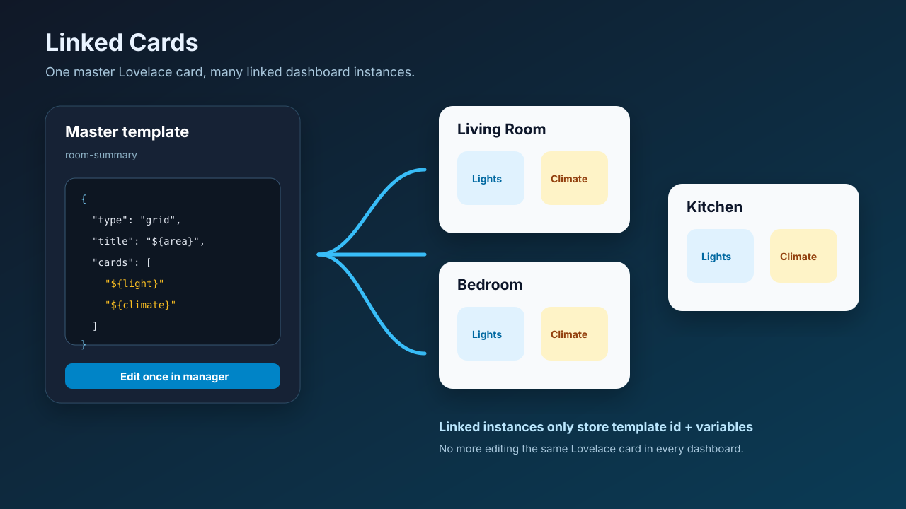

# Linked Cards for Home Assistant

Reusable, storage-backed dashboard cards for Home Assistant UI-mode dashboards.

Linked Cards fills the gap between Home Assistant's friendly visual dashboard editor and YAML-only reuse tools such as `decluttering-card`. Define a **master card template** once, then place lightweight linked instances anywhere. When the master template changes, every linked instance renders the new card configuration after refresh.



## Why this exists

Home Assistant users often maintain several dashboards: wall tablet, phone, admin, energy, room-specific views, guest views. The same room card, security card, navigation card, or status stack is copied repeatedly. Today that means:

- edit the same card YAML in multiple places;
- risk inconsistent versions across dashboards;
- use YAML-heavy `decluttering-card` / `streamline-card`; or
- give up the UI dashboard editor.

Community requests repeatedly ask for native "master card", "linked card", or "reusable card" support in UI mode. This project is a practical HACS-friendly implementation of that missing layer.

## What it provides

- `custom:linked-card` — renders a stored master card by template id, or renders cards directly from another dashboard/view.
- `custom:linked-section` — renders a stored master section (title + card grid) by template id.
- `linked-card-manager` — now creates and edits both card and section templates from the Home Assistant UI.
- `custom:linked-card-manager` — dashboard card for creating/editing templates from the Home Assistant UI.
- Visual editor support for `custom:linked-card` instances: template picker, variable overrides, source-dashboard mode, and inline/popup display.
- Source-dashboard mode compatible with Global-cards-style workflows: maintain pop-ups, headers, or shared UI on a source dashboard and reuse them elsewhere.
- Home Assistant custom integration storage under `.storage/linked_cards.templates`.
- Safe variable substitution using `${variable}` placeholders.
- Any Lovelace card can be the child card: tile, grid, entities, custom cards, Bubble Card pop-ups, etc.
- Live template update events: saved/deleted templates re-render affected linked-card instances without waiting for a full dashboard refresh.
- Template export/import from the manager card.
- Static JS resource served by the integration at `/linked-cards/linked-card.js`.
- REST API for advanced users and future UI tooling.

## Installation

### HACS custom repository

1. HACS → Integrations → ⋮ → Custom repositories.
2. Add this repository URL.
3. Category: **Integration**.
4. Install **Linked Cards**.
5. Restart Home Assistant.
6. Go to **Settings → Devices & services → Add integration** and add **Linked Cards**.
7. Add the frontend resource:

```yaml
url: /linked-cards/linked-card.js
type: module
```

Or add it from **Settings → Dashboards → Resources**.

### Manual install

Copy this folder into Home Assistant:

```text
custom_components/linked_cards
```

Restart Home Assistant, add **Linked Cards** from **Settings → Devices & services**, then add the resource:

```text
/linked-cards/linked-card.js
```

## Quick start

### 1. Add a manager card to an admin-only dashboard

```yaml
type: custom:linked-card-manager
template: room-summary
```

Paste and save this master template:

```json
{
  "description": "Reusable room summary grid with a light and climate tile.",
  "variables": {
    "area": "Living Room",
    "light": "light.living_room",
    "climate": "climate.living_room"
  },
  "card": {
    "type": "grid",
    "title": "${area}",
    "columns": 2,
    "square": false,
    "cards": [
      {
        "type": "tile",
        "entity": "${light}",
        "name": "Lights",
        "features": [{ "type": "light-brightness" }]
      },
      {
        "type": "tile",
        "entity": "${climate}",
        "name": "Climate",
        "features": [{ "type": "target-temperature" }]
      }
    ]
  }
}
```

### 2. Place linked instances anywhere

Use the Home Assistant visual editor when adding `custom:linked-card`. The editor lets you select **Template** mode, choose a stored template, and enter variable overrides as JSON.

Living room:

```yaml
type: custom:linked-card
template: room-summary
variables:
  area: Living Room
  light: light.living_room
  climate: climate.living_room
```

Bedroom:

```yaml
type: custom:linked-card
template: room-summary
variables:
  area: Bedroom
  light: light.bedroom
  climate: climate.bedroom
```

Kitchen with a fallback if the template is missing:

```yaml
type: custom:linked-card
template: room-summary
variables:
  area: Kitchen
  light: light.kitchen
  climate: climate.kitchen
fallback:
  type: markdown
  content: Linked card template is not available.
```

## Source-dashboard mode

Source-dashboard mode lets you maintain shared cards on a normal Home Assistant dashboard and render them elsewhere. This is useful for Global-cards-style workflows such as Bubble Card pop-ups, shared headers, and reusable navigation sections.

Create a source dashboard, for example `global-cards`, then add the cards you want to reuse with Home Assistant's normal visual editor.

### Inline shared cards

```yaml
type: custom:linked-card
mode: source
source_dashboard: global-cards
source_view: header
source_display: inline
```

- `source_dashboard` is the dashboard `url_path`.
- `source_view` is optional and can be a view path or view title. Omit it to load all views.
- `source_display: inline` renders the cards in place.
- Sections views are supported; card `grid_options.columns` are respected in a 12-column grid fallback.

### Popup/invisible source cards

```yaml
type: custom:linked-card
mode: source
source_dashboard: global-cards
source_view: popups
source_display: popup
```

`source_display: popup` mounts the source cards invisibly under the Lovelace root in normal view mode. In edit mode, the card shows a status panel with the dashboard, view, display mode, and loaded card count.

This pattern works well for Bubble Card pop-ups defined once on a source dashboard and opened from buttons on other dashboards.

## Linked Sections

Just as linked cards let you define a master card once and reuse it everywhere, linked sections let you define a reusable **section** (title + grid of cards) as a stored template and place it on any dashboard with `custom:linked-section`.

A section template stores a `title` and an array of `cards`, along with optional `grid_options.columns` to control default column sizing. Variables let you parameterise entity IDs, titles, and any other card field.

### Create a section template

Use the manager card and select **Section template** to save a master section:

```json
{
  "description": "Reusable room controls section with lights and climate.",
  "variables": {
    "area": "Living Room",
    "light": "light.living_room",
    "climate": "climate.living_room"
  },
  "section": {
    "title": "${area} Controls",
    "grid_options": { "columns": 2 },
    "cards": [
      {
        "type": "tile",
        "entity": "${light}",
        "name": "Lights",
        "features": [{ "type": "light-brightness" }]
      },
      {
        "type": "tile",
        "entity": "${climate}",
        "name": "Climate",
        "features": [{ "type": "target-temperature" }]
      }
    ]
  }
}
```

### Place a linked section

```yaml
type: custom:linked-section
template: room-controls
variables:
  area: Living Room
  light: light.living_room
  climate: climate.living_room
```

For the office:

```yaml
type: custom:linked-section
template: room-controls
variables:
  area: Office
  light: light.office
  climate: climate.office
```

The section renders with the given title and cards, all laid out in a responsive grid. Edit the master template once; refresh dashboards and all uses show the new configuration.

### Section schema

| Field | Required | Type | Description |
|-------|----------|------|-------------|
| `title` | Yes | string | Section heading. Supports `${variable}` substitution. |
| `cards` | Yes | array | Array of Lovelace card configs. |
| `grid_options.columns` | No | number | Default column count used to size cards that don’t set their own `grid_options.columns`. |


## Template format

```json
{
  "description": "Optional human-readable notes.",
  "variables": {
    "default_name": "Default values are optional"
  },
  "card": {
    "type": "tile",
    "entity": "${entity}",
    "name": "${name}"
  }
}
```

Rules:

- `card` is required and must be a Lovelace card object.
- `variables` is optional and supplies defaults.
- Instance variables override template defaults.
- Placeholders work in strings and object keys: `${area}`, `${entity}`, `${nested.value}`.
- Missing variables render as an empty string so a broken template is visible rather than silently using stale values.
- Template ids may contain letters, numbers, `.`, `_`, and `-` only.

## Manager export/import

The `custom:linked-card-manager` card can:

- save and delete stored templates;
- export the selected template as JSON;
- export all templates as a JSON archive;
- import a template JSON file and save it back to Home Assistant storage.

Imported files may use either of these shapes:

```json
{ "template_id": "room-summary", "template": { "card": { "type": "tile", "entity": "light.example" } } }
```

or a raw template payload:

```json
{ "variables": {}, "card": { "type": "tile", "entity": "light.example" } }
```

## API

All endpoints require normal Home Assistant authentication.

### List templates

```http
GET /api/linked_cards/templates
```

Response:

```json
{
  "templates": {
    "room-summary": {
      "variables": {},
      "card": { "type": "tile", "entity": "light.example" }
    }
  }
}
```

### Save template

```http
POST /api/linked_cards/templates/room-summary
Content-Type: application/json

{
  "variables": { "entity": "light.example" },
  "card": { "type": "tile", "entity": "${entity}" }
}
```

### Delete template

```http
DELETE /api/linked_cards/templates/room-summary
```

### Live update event

When a template is saved or deleted, the integration fires a Home Assistant event:

```text
linked_cards_template_updated
```

Event data:

```json
{ "template_id": "room-summary", "action": "saved" }
```

Open linked-card instances subscribe to this event, invalidate the affected cache entry, and re-render matching template-based cards.

## Example patterns

### Shared navigation card

Create one navigation grid and reuse it on every dashboard. Update paths/icons once.

```json
{
  "card": {
    "type": "grid",
    "columns": 4,
    "square": false,
    "cards": [
      { "type": "button", "name": "Home", "icon": "mdi:home", "tap_action": { "action": "navigate", "navigation_path": "/lovelace/home" } },
      { "type": "button", "name": "Lights", "icon": "mdi:lightbulb", "tap_action": { "action": "navigate", "navigation_path": "/lovelace/lights" } },
      { "type": "button", "name": "Energy", "icon": "mdi:lightning-bolt", "tap_action": { "action": "navigate", "navigation_path": "/energy" } },
      { "type": "button", "name": "Security", "icon": "mdi:shield-home", "tap_action": { "action": "navigate", "navigation_path": "/lovelace/security" } }
    ]
  }
}
```

### Shared device-status card

Use one template for routers, servers, NAS devices, or 3D printers.

```json
{
  "variables": {
    "name": "Device",
    "power": "sensor.device_power",
    "status": "binary_sensor.device_online"
  },
  "card": {
    "type": "entities",
    "title": "${name}",
    "entities": ["${status}", "${power}"]
  }
}
```

## Security and privacy

- Templates are stored locally in Home Assistant storage.
- The integration does not call external services.
- Normal Home Assistant auth protects the API.
- Template reads are available to authenticated users so linked cards can render.
- Template create/update/delete actions require a Home Assistant administrator account.
- Template ids, size, nesting depth, count, and top-level shape (`card` or `section`) are validated server-side.
- Do not store secrets in card templates. Treat template JSON like dashboard YAML.

## Limitations

- Source-dashboard mode reads Lovelace dashboard config through the frontend connection; the source dashboard must be accessible to the current user.
- Source-dashboard configs are cached in the browser for 60 seconds.
- The manager's template body remains JSON so any Lovelace/custom card can be represented exactly. Use source-dashboard mode when you want to author the shared card itself with Home Assistant's native visual editor.
- Variables are string interpolation, not arbitrary JavaScript or Jinja. This is intentional for safety and portability.
- Cross-dashboard use works because templates are stored globally by the integration, not inside a single dashboard config.

## Roadmap

- [x] Visual template picker/editor for linked-card instances.
- [x] Visual template picker/editor for linked-section instances.
- [x] Source-dashboard mode for Global-cards-style reusable pop-ups/headers.
- [x] Live update event after saving/deleting a template.
- [x] Template export/import.
- [ ] Import duplicated existing dashboard cards as stored templates.
- [ ] Per-template usage search across dashboards.
- [ ] Optional variable schema so instances get a richer generated UI form.

## Development

```bash
npm install
npm test
npm run build
```

Build output is copied to:

```text
custom_components/linked_cards/www/linked-card.js
```

## Validation performed

- Vitest unit tests for template id validation, recursive variable rendering, default/override behaviour, source-dashboard structure extraction, editor wiring, live event wiring, and package layout.
- ESBuild bundle generation.
- Python syntax compilation for the Home Assistant custom component.
- README verified for v0.2.0 feature coverage: source-dashboard mode, visual editor, live events, export/import, and updated roadmap.

This project was developed with the assistance of AI tools.

## License

MIT
